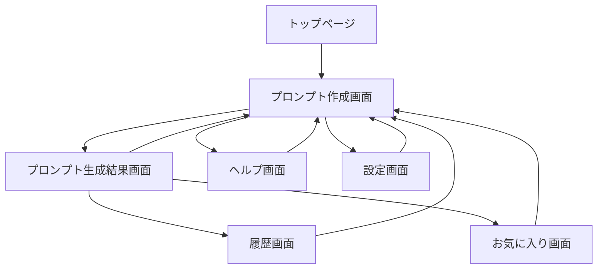

# 画面遷移図・ワイヤーフレーム仕様書

## 1. 画面遷移図

### 1.1 基本画面フロー



### 1.2 詳細画面遷移

```
1. トップページ
   ├── プロンプト作成開始 → プロンプト作成画面
   ├── 履歴を見る → 履歴画面
   ├── お気に入り → お気に入り画面
   └── ヘルプ → ヘルプ画面

2. プロンプト作成画面
   ├── カテゴリ選択
   ├── 詳細選択（動的更新）
   ├── 色選択
   ├── スタイル選択
   ├── 雰囲気選択
   ├── 照明選択
   ├── サイズ選択
   └── プロンプト生成 → プロンプト生成結果画面

3. プロンプト生成結果画面
   ├── コピー（クリップボードへ）
   ├── お気に入り登録
   ├── 編集して再生成 → プロンプト作成画面
   └── 新規作成 → プロンプト作成画面（リセット）

4. 履歴画面
   ├── 履歴項目選択 → プロンプト作成画面（データ復元）
   ├── 削除
   └── 戻る → 前の画面
```

## 2. 画面ワイヤーフレーム

### 2.1 トップページ

```
┌─────────────────────────────────────────────────┐
│  ビジュアルプロンプトビルダー                    │
│  ═══════════════════════════════════════════    │
│                                                 │
│  ┌───────────────────────────────────────────┐ │
│  │                                             │ │
│  │    🎨 プロンプトを作ってみよう！             │ │
│  │                                             │ │
│  │    AIで素敵な画像を作るための              │ │
│  │    言葉を簡単に作れます                    │ │
│  │                                             │ │
│  └───────────────────────────────────────────┘ │
│                                                 │
│  ┌─────────────────┐  ┌─────────────────┐    │
│  │                 │  │                 │    │
│  │  📝 新規作成     │  │  📚 履歴        │    │
│  │                 │  │                 │    │
│  └─────────────────┘  └─────────────────┘    │
│                                                 │
│  ┌─────────────────┐  ┌─────────────────┐    │
│  │                 │  │                 │    │
│  │  ⭐ お気に入り   │  │  ❓ ヘルプ      │    │
│  │                 │  │                 │    │
│  └─────────────────┘  └─────────────────┘    │
│                                                 │
└─────────────────────────────────────────────────┘
```

### 2.2 プロンプト作成画面（モバイル版）

```
┌─────────────────────────────────────┐
│ ← 戻る    プロンプト作成    ⚙設定  │
│ ═══════════════════════════════════ │
│                                     │
│ 進捗: ●●●○○○○                      │
│                                     │
│ 【1. カテゴリを選ぼう】             │
│ ┌─────────┐ ┌─────────┐         │
│ │  🏔️      │ │  🐾      │         │
│ │  風景    │ │  動物    │         │
│ └─────────┘ └─────────┘         │
│ ┌─────────┐ ┌─────────┐         │
│ │  👤      │ │  🎨      │         │
│ │  人物    │ │ 抽象画   │         │
│ └─────────┘ └─────────┘         │
│                                     │
│ もっと見る ▼                       │
│                                     │
│ 自由記述:                          │
│ ┌─────────────────────────────┐   │
│ │                               │   │
│ └─────────────────────────────┘   │
│                                     │
│ ┌─────────────────────────────┐   │
│ │         次へ →                │   │
│ └─────────────────────────────┘   │
└─────────────────────────────────────┘
```

### 2.3 プロンプト作成画面（デスクトップ版）

```
┌───────────────────────────────────────────────────────────────────────┐
│ ビジュアルプロンプトビルダー                              ⚙ 設定 ❓ ヘルプ │
│ ═════════════════════════════════════════════════════════════════════ │
│                                                                       │
│ 進捗: ●●●●●○○  5/7                                                   │
│                                                                       │
│ ┌─────────────────────────────┬───────────────────────────────────┐ │
│ │                             │                                   │ │
│ │  プレビューエリア            │  【5. 雰囲気を選ぼう】             │ │
│ │                             │                                   │ │
│ │  選択内容:                  │  ┌───────┐ ┌───────┐ ┌───────┐ │ │
│ │  ✓ カテゴリ: 動物          │  │  😊   │ │  😌   │ │  🌟   │ │ │
│ │  ✓ 詳細: 猫                │  │ 楽しい │ │ 穏やか │ │神秘的 │ │ │
│ │  ✓ 色: パステルカラー       │  └───────┘ └───────┘ └───────┘ │ │
│ │  ✓ スタイル: 水彩画         │                                   │ │
│ │  → 雰囲気: 選択中...        │  ┌───────┐ ┌───────┐ ┌───────┐ │ │
│ │                             │  │  🎭   │ │  💕   │ │  📖   │ │ │
│ │                             │  │ﾄﾞﾗﾏﾁｯｸ│ │ﾛﾏﾝﾁｯｸ │ │ﾉｽﾀﾙｼﾞｯｸ│ │ │
│ │                             │  └───────┘ └───────┘ └───────┘ │ │
│ │                             │                                   │ │
│ │                             │  自由記述:                        │ │
│ │                             │  ┌───────────────────────────┐ │ │
│ │                             │  │                           │ │ │
│ │                             │  └───────────────────────────┘ │ │
│ └─────────────────────────────┴───────────────────────────────────┘ │
│                                                                       │
│ ┌─────────────┐  ┌─────────────────────────┐  ┌─────────────┐   │
│ │   ← 戻る    │  │      プロンプトを生成      │  │   次へ →    │   │
│ └─────────────┘  └─────────────────────────┘  └─────────────┘   │
└───────────────────────────────────────────────────────────────────────┘
```

### 2.4 プロンプト生成結果画面

```
┌─────────────────────────────────────────────────┐
│ ← 戻る         生成結果                         │
│ ═══════════════════════════════════════════════ │
│                                                 │
│ 🎉 プロンプトが完成しました！                    │
│                                                 │
│ ┌─────────────────────────────────────────────┐ │
│ │ a cute cat, pastel colors, watercolor      │ │
│ │ style, calm atmosphere, soft lighting,     │ │
│ │ square format, high quality, detailed,     │ │
│ │ beautiful composition, professional,       │ │
│ │ 8K resolution, sharp focus, masterpiece,   │ │
│ │ best quality, ultra detailed,              │ │
│ │ photorealistic, cinematic lighting,        │ │
│ │ vibrant colors                             │ │
│ └─────────────────────────────────────────────┘ │
│                                                 │
│ ┌───────────────────┐ ┌───────────────────┐   │
│ │                   │ │                   │   │
│ │  📋 コピーする     │ │  ⭐ お気に入り     │   │
│ │                   │ │    に追加         │   │
│ └───────────────────┘ └───────────────────┘   │
│                                                 │
│ ┌───────────────────┐ ┌───────────────────┐   │
│ │                   │ │                   │   │
│ │  ✏️ 編集して       │ │  🆕 新規作成       │   │
│ │    再生成         │ │                   │   │
│ └───────────────────┘ └───────────────────┘   │
│                                                 │
│ 【ネガティブプロンプト】                         │
│ ┌─────────────────────────────────────────────┐ │
│ │ worst quality, low quality, ugly,          │ │
│ │ bad anatomy, jpeg artifacts...             │ │
│ └─────────────────────────────────────────────┘ │
└─────────────────────────────────────────────────┘
```

## 3. レスポンシブデザイン仕様

### 3.1 ブレークポイント

| デバイス | 画面幅 | レイアウト | 列数 |
|---------|--------|-----------|------|
| モバイル | 0-767px | 縦積み | 1列 |
| タブレット | 768-1023px | 2カラム | 2列 |
| デスクトップ | 1024px以上 | 3カラム | 3-4列 |

### 3.2 コンポーネントサイズ

| 要素 | モバイル | タブレット | デスクトップ |
|------|---------|-----------|-------------|
| ボタン高さ | 60px | 50px | 44px |
| フォントサイズ | 18px | 16px | 16px |
| アイコンサイズ | 32px | 28px | 24px |
| 余白（padding） | 20px | 16px | 12px |

## 4. UI/UXガイドライン

### 4.1 色彩設計

```
プライマリカラー:   #4A90E2 （青）- 主要アクション
セカンダリカラー:   #7ED321 （緑）- 成功・完了
アクセントカラー:   #F5A623 （橙）- 注目・選択中
エラーカラー:       #D0021B （赤）- エラー・警告
背景色:             #F8F9FA （薄灰）
テキスト色:         #333333 （濃灰）
```

### 4.2 インタラクション

- **ホバー効果**: デスクトップでマウスオーバー時に要素を5%拡大
- **タップ効果**: タッチデバイスでタップ時に要素を95%縮小（0.1秒）
- **遷移アニメーション**: 画面切り替え時にスライドイン（0.3秒）
- **ローディング**: 処理中はスピナーアニメーション表示

### 4.3 アクセシビリティ配慮

- **フォーカス表示**: キーボード操作時に明確なフォーカス枠
- **タブ順序**: 論理的な順序でのタブ移動
- **ARIAラベル**: スクリーンリーダー用の適切なラベル付け
- **コントラスト比**: WCAG AAレベル（4.5:1以上）

## 5. 画面別詳細仕様

### 5.1 カテゴリ選択画面

- グリッドレイアウトで表示（モバイル2列、タブレット3列、デスクトップ4列）
- 各カテゴリにアイコンとテキストラベル
- 選択時にバウンスアニメーション
- 自由記述欄は画面下部に配置

### 5.2 詳細選択画面

- カテゴリに応じて動的に内容変更
- チェックボックス形式で複数選択可能
- 選択数上限（5個）に達したら他の項目を無効化
- ドラッグで順序変更可能（デスクトップのみ）

### 5.3 プロンプト生成結果画面

- プロンプトテキストは選択可能な状態で表示
- コピーボタンクリックで「コピーしました」トースト表示
- お気に入り登録時は星アイコンがアニメーション
- ネガティブプロンプトは折りたたみ可能